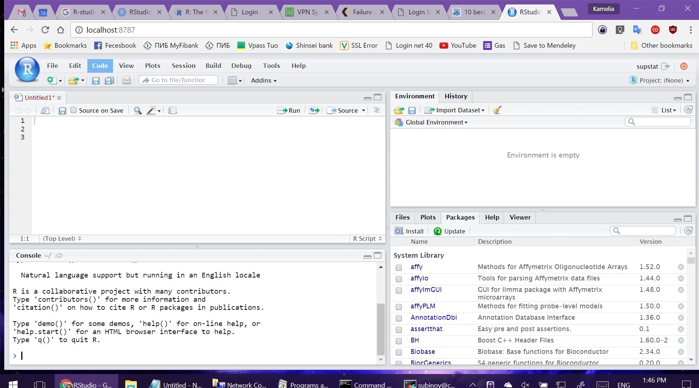

# Server Management Guide

This repository provides clear and concise instructions for accessing and managing the RStudio Server within the IRCMS network. All IP addresses have been anonymized for security. Please replace any placeholders (`10.0.0.10`, `vpn.example.com`) with your actual, assigned values.

---

## Table of Contents

- [Requirements](#requirements)
- [Internal Access](#internal-access)
- [External Access (via VPN)](#external-access-via-vpn)
- [SSH Tunnel Setup](#ssh-tunnel-setup)
- [Troubleshooting](#troubleshooting)

---

## Requirements

- **Network**: Your machine must be within the organization’s network range (`10.0.0.0/24`).
- **Credentials**:
  - RStudio Server username and password
  - VPN user ID and password (for external access)
- **Software**:
  - Web browser (Chrome, Firefox, Edge, Safari)
  - **Windows**: [MobaXterm](http://mobaxterm.mobatek.net/) (free)
  - **macOS / Linux**: native `ssh` client and VPN client as per university guidance

---

## Internal Access

1. Connect your machine to the internal network (e.g., via wired or Wi-Fi).

2. Open your web browser.

3. Navigate to:

   ```
   http://10.0.0.10:8787
   ```

4. Enter your RStudio Server **username** and **password** when prompted.

5. You will be presented with the familiar RStudio IDE in your browser.

   
    
---

## External Access (via VPN)

To securely access the server from outside the network, you must first establish a VPN connection.

1. Install the VPN client according to the institution’s instructions.

2. Launch the VPN client and connect to:

   ```
   vpn.example.com
   ```

3. Log in with your VPN **user ID** and **password**.

Once connected, proceed to the SSH Tunnel Setup below.

---

## SSH Tunnel Setup

After VPN connection, you need to forward the RStudio port (`8787`) to your local machine. Replace `<USER>` with your actual RStudio username.

### Windows (MobaXterm)

1. Open MobaXterm and start a new terminal session.

2. Run:

   ```bash
   ssh -L 8787:localhost:8787 <USER>@10.0.0.10
   ```

3. After successful login, open your browser and go to:

   ```
   http://localhost:8787
   ```

   

4. Enter your RStudio credentials to access the IDE.

   

### macOS / Linux

1. Open Terminal.

2. Run the same SSH command:

   ```bash
   ssh -L 8787:localhost:8787 <USER>@10.0.0.10
   ```

3. Once connected, open your browser and navigate to `http://localhost:8787`, then log in.

   

   

---

## Troubleshooting

- **Cannot connect to `10.0.0.10:8787`**:
  - Verify your machine’s network connection.
  - Confirm the internal network range (`10.0.0.0/24`).

- **VPN connection fails**:
  - Check your VPN credentials.
  - Ensure the VPN client is up to date.

- **SSH tunnel issues**:
  - Make sure port `8787` is not in use locally.
  - Add `-v` (verbose) to your SSH command for debugging:
    ```bash
    ssh -v -L 8787:localhost:8787 <USER>@10.0.0.10
    ```

- **Still stuck?** Contact the IT Helpdesk with details of your error message.
